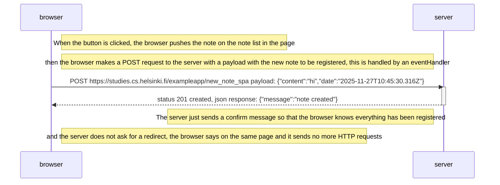

```mermaid
sequenceDiagram
    participant browser
    participant server

    Note right of browser: When the button is clicked, the browser pushes the note on the note list in the page
    Note left of server: then the browser makes a POST request to the server with a payload with the new note to be registered, this is handled by an eventHandler

    browser->>server: POST https://studies.cs.helsinki.fi/exampleapp/new_note_spa payload: {"content":"hi","date":"2025-11-27T10:45:30.316Z"}
    activate server
    server-->>browser: status 201 created, json response: {"message":"note created"}
    deactivate server

    Note left of server: The server just sends a confirm message so that the browser knows everything has been registered
    Note right of browser: and the server does not ask for a redirect, the browser says on the same page and it sends no more HTTP requests
```
