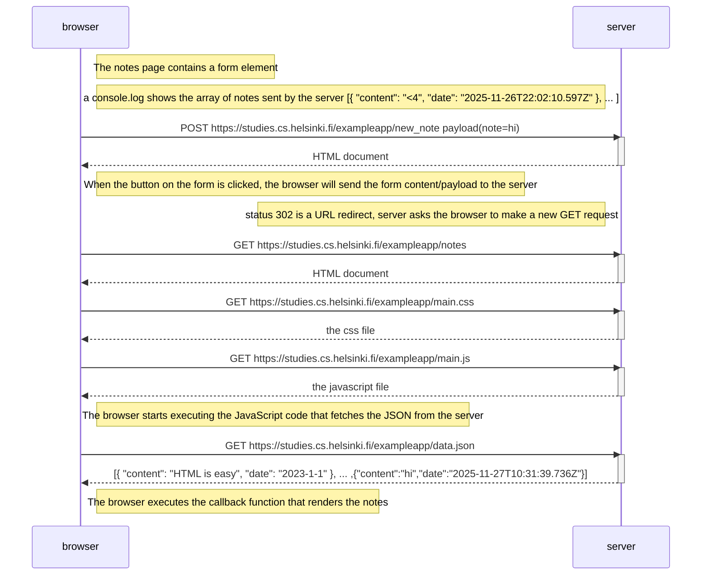

```mermaid
sequenceDiagram
    participant browser
    participant server

    Note right of browser: The notes page contains a form element
    Note left of server: a console.log shows the array of notes sent by the server [{  "content": "<4", "date": "2025-11-26T22:02:10.597Z" }, ... ]

    browser->>server: POST https://studies.cs.helsinki.fi/exampleapp/new_note payload(note=hi)
    activate server
    server-->>browser: HTML document
    deactivate server

    Note right of browser: When the button on the form is clicked, the browser will send the form content/payload to the server
    Note left of server: status 302 is a URL redirect, server asks the browser to make a new GET request

    browser->>server: GET https://studies.cs.helsinki.fi/exampleapp/notes
    activate server
    server-->>browser: HTML document
    deactivate server

    browser->>server: GET https://studies.cs.helsinki.fi/exampleapp/main.css
    activate server
    server-->>browser: the css file
    deactivate server

    browser->>server: GET https://studies.cs.helsinki.fi/exampleapp/main.js
    activate server
    server-->>browser: the javascript file
    deactivate server

    Note right of browser: The browser starts executing the JavaScript code that fetches the JSON from the server

    browser->>server: GET https://studies.cs.helsinki.fi/exampleapp/data.json
    activate server
    server-->>browser: [{ "content": "HTML is easy", "date": "2023-1-1" }, ... ,{"content":"hi","date":"2025-11-27T10:31:39.736Z"}]
    deactivate server

    Note right of browser: The browser executes the callback function that renders the notes
```
